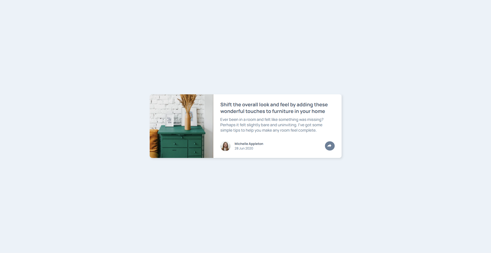
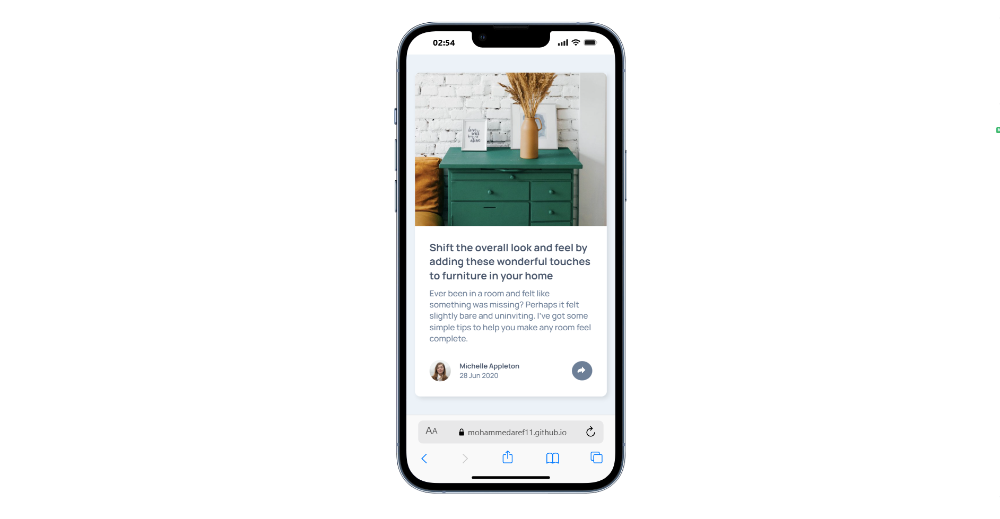
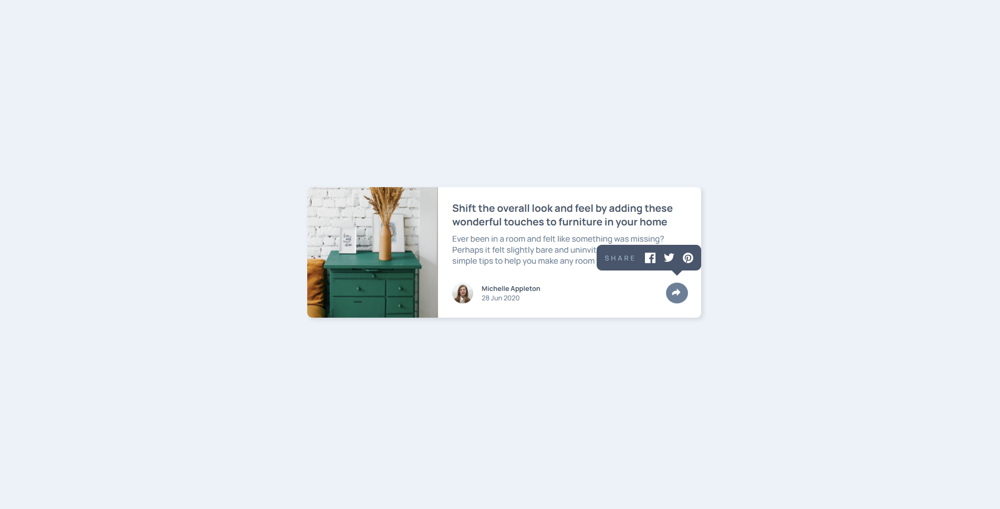
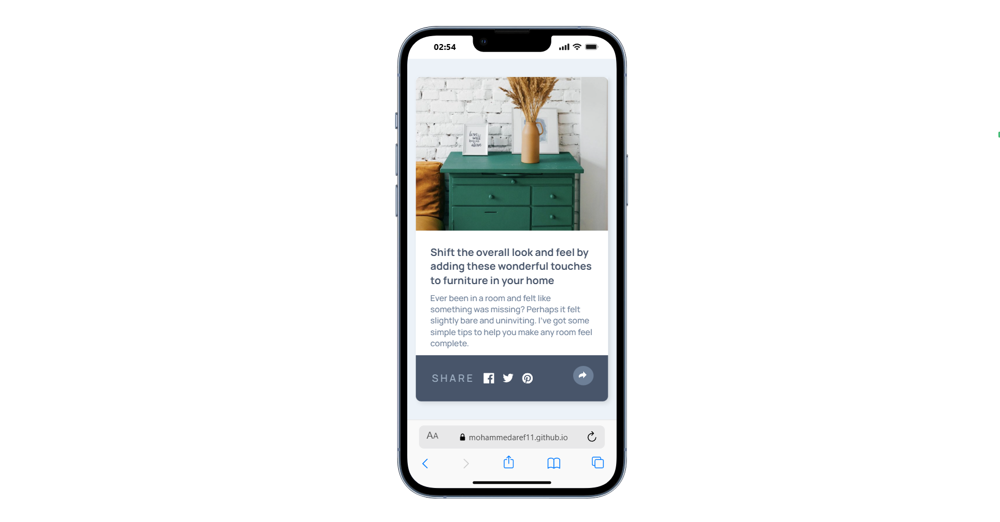

# Article preview card 


Doing this challenge was simple but i had a little bit of a challenge when it comes to switching between `hide` and `show` classes on the share button after some trial and error the solution was by using `toggle` to solve the problem.

```js
shareBtn.addEventListener("click", () => { 
    shareCon.classList.toggle("hide");  
    shareCon.classList.toggle("show");   
})
```

Here is the website link if you want to check it out [Click Here](https://mohammedaref11.github.io/Article-preview-card/)

Here is the Challenge like if you want to try it out your self [Click Here](https://www.frontendmentor.io/challenges/article-preview-component-dYBN_pYFT)


## Desktop



## Mobile 



## Active states 






